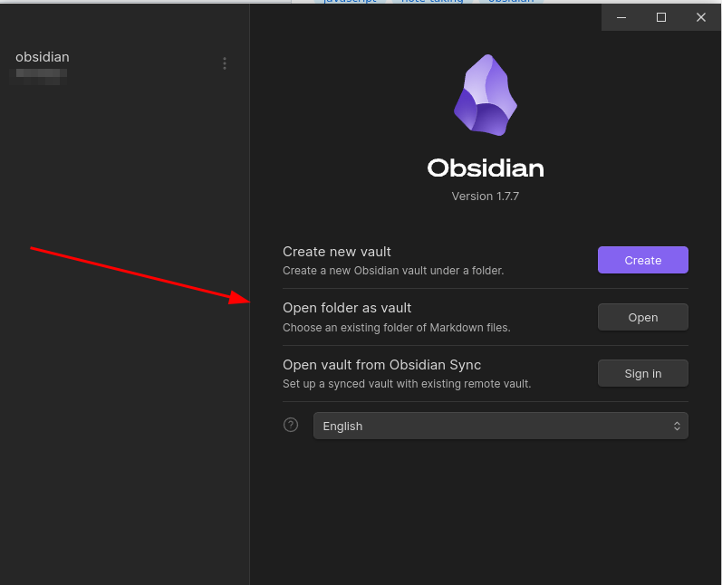
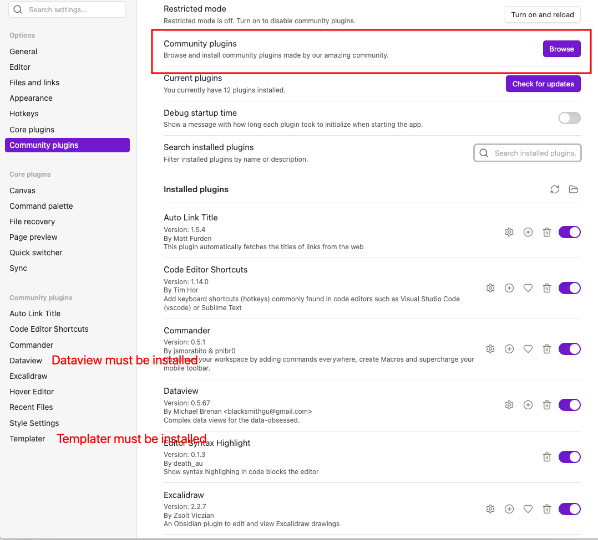
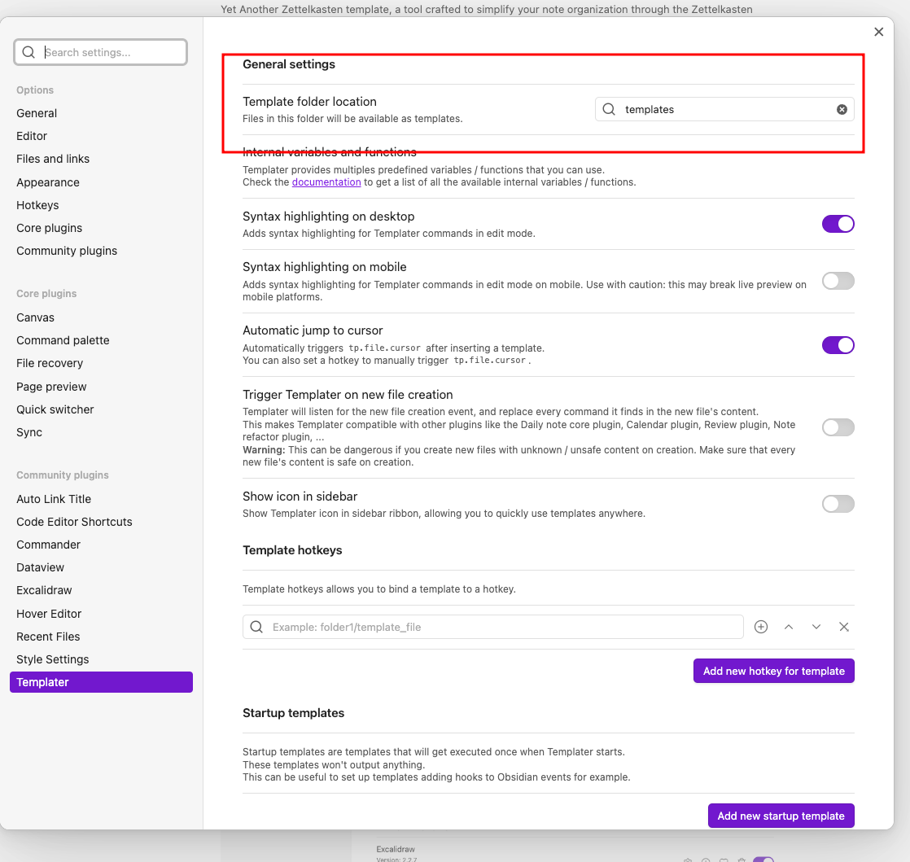
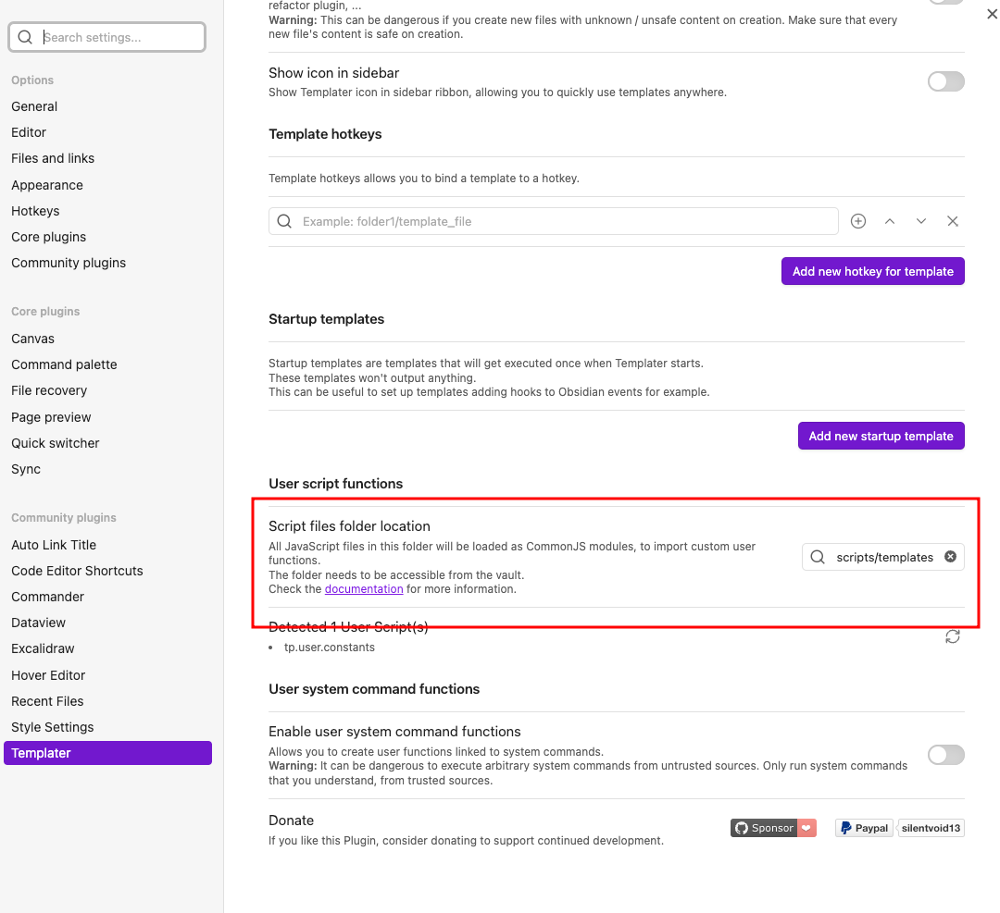

Yet Another Zettelkasten template, a tool crafted to simplify your note organization through the Zettelkasten method. Explore the [[00_Home MOC]] for detailed insights.

# Setup Guide

## Installation

1. git clone this repository -  `git clone https://github.com/yourusername/obsidian-template.git my-notes` or download the repository as a zip file and extract it to a folder named `my-notes`.

2. Open Obsidian app and create a new vault pointing to the `my-notes` folder. - Open folder as vault`
3. Go to [manage vault](https://help.obsidian.md/Files+and+folders/Manage+vaults)

4. This will automatically set up the necessary plugins and settings.
5. Restart or reload the Obsidian app to ensure all plugins are correctly installed and settings are applied.

## Manual Setup

If the above steps fail, follow these manual setup instructions to ensure proper configuration.

### Enable Community Plugins

1. Open Obsidian.
2. Navigate to `Settings > Community plugins > Browse`.
3. Enable community plugins if they are turned off (this is the default behavior).

### Install Required Plugins

1. Search for and install the following plugins:
  - [Dataview](https://obsidian.md/plugins?search=dataview)
  - [Templater](https://obsidian.md/plugins?id=templater-obsidian)
  - [Commander](https://obsidian.md/plugins?search=Commander) - This plugin allows you to swipe down from the top on a mobile device to display the "Create from template" option.

### Setup Templater

1. Change the **Template folder location** to "templates".
2. Change the **Script files folder location** to "scripts/templates".

### Setup Default Created Notes Folder Destination

1. Go to `Settings > Files and links > Default location for new notes`.
2. In the dropdown menu, select "In the folder specified below".
3. Set the "Folder to create new notes in" setting to **notes**.

> You might want to check out the scripts under the `scripts` folder that contain constants for formatting dates and other similar purposes.

## Customization

Make your Zettelkasten uniquely yours by personalizing templates found in `/templates/`. Tailor the system to match your distinctive style and preferences.

## Templates

Utilize the convenient shortcut `ctrl + N` on Windows or `cmd + N` on Mac to create a new note and choose from a variety of templates.

To learn more about using templates, please refer to the [Templater](https://silentvoid13.github.io/Templater/) documentation

> `/templates/macros/z_init.md` - This file is used in each template to insert metadata such as links, creation date, ordinal numbers, and tags.

> `/templates/macros/z_habit.md` - This file is used in each journal or daily template, recommended for tracking frequent habits or tasks you usually do, especially those that may change unexpectedly

## Display

Most of the MOC files utilize the Dataview plugin. To customize them, please refer to the [Dataview](https://blacksmithgu.github.io/obsidian-dataview/) documentation.

## Theme
You can customize the appearance of your Obsidian notes by using the [Style Settings](https://obsidian.md/plugins?search=Style%20settings) plugin or exploring other style settings options

## Journaling

For a structured daily journal, update templates under `/templates/macros/z_daily_task_start.md` and `/templates/macros/z_daily_task_end.md`.

# Explore More

## Related Resources

- [[Zettelkasten study from Youtube]]
- [[Digital Zettelkasten- Principles, Methods, & Examples]]
- [Linking Your Thinking](https://www.linkingyourthinking.com/)

Feel free to suggest improvements. Enjoy a seamless and efficient note-taking journey!